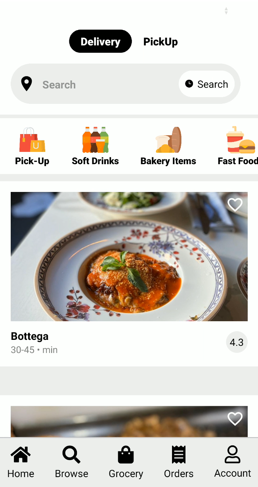
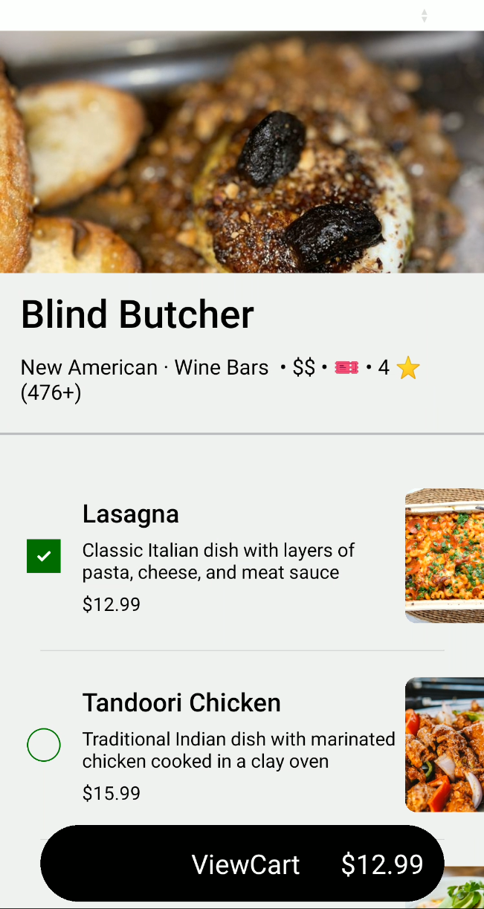
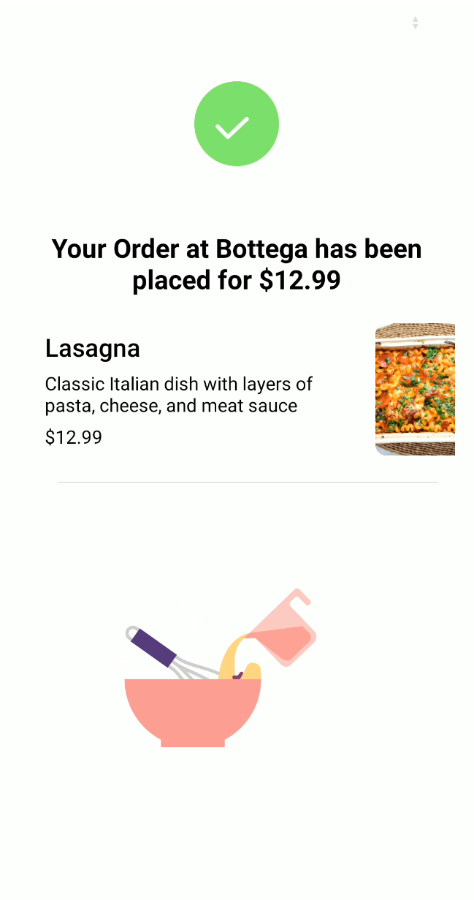

# Uber Eats Clone

Welcome to the **Uber Eats Clone** project! This is a full-featured mobile application that mimics the core functionality of Uber Eats, built with **React Native** using the **Expo Bare Workflow**. It supports custom native modules, minimal Firebase integration for order tracking and distribution, and is set up for production-ready Android builds with Kotlin, Java 17, and Gradle 8.10+.

---

## 🚀 Features

- 🍔 Browse restaurants and food items
- 📋 View restaurant menus and item details
- 🛒 Place orders and track delivery status
- 🔐 Firebase is used to store order data and handle APK distribution via Fastlane
- 🔄 Real-time Redux-powered state management
- ⚙️ Native Android builds (Kotlin + Java 17)
- 🧒 Fastlane + Firebase App Distribution
- 🚀 CI/CD with GitHub Actions
- 🔍 Location-based search using Google Places API (with secure `.env` setup) — supports alternatives like LocationIQ or Mapbox if needed

---

## 🧑‍💻 Workflow

This project uses the **Expo Bare Workflow**, which means:

- You have full access to native code (Android/iOS folders exist).
- Expo modules are installed and used (`expo-modules-core`, `expo-dev-client`, etc.).
- You are responsible for native builds (Gradle for Android, Xcode for iOS).
- It is **not** managed by `expo start` Metro bundler alone — native compilation is required.

---

## 🛠️ Installation & Build Setup

### 1. Clone the repository

```bash
git clone https://github.com/chiragdhunna/uber_eats_clone.git
cd uber_eats_clone
```

### 2. Install dependencies

```bash
npm install --legacy-peer-deps
```

> ℹ️ We use `--legacy-peer-deps` to avoid peer version conflicts in some older React Native and Expo packages.

---

### 3. Setup Firebase

- Create a Firebase project at [console.firebase.google.com](https://console.firebase.google.com)
- Enable Firestore or Realtime Database for order data
- Enable Authentication (if required)
- Use Firebase for **distributing APKs via Fastlane**
- Place your Firebase config in a `firebase.js` file at the project root

---

### 4. Configure Google Places API (via .env)

This project uses the Google Places API for location-based autocomplete in the search bar.

- Create a `.env` file in the root directory:

```env
GOOGLE_MAPS_API_KEY=your_google_maps_api_key_here
```

- Make sure `.env` is listed in `.gitignore`
- You can also use free alternatives like LocationIQ or Mapbox by replacing the GooglePlacesAutocomplete component

> Note: The key is automatically injected into the build via GitHub Actions for CI deployment.

---

### 5. Rebuild Native Code (✅ Must-Do Before First Build)

Run this to regenerate the native code with clean versions:

```bash
rm -rf node_modules/ package-lock.json android ios .expo
npm install --legacy-peer-deps
npx expo prebuild
```

---

### 6. Run Android App

```bash
npx expo run:android
```

> ✅ Make sure you have Android Studio installed and Java 17 configured

---

### 7. (Optional) Run on iOS (macOS only)

```bash
npx expo run:ios
```

> You must have Xcode and CocoaPods installed

---

## 🚼 Troubleshooting Common Issues

### Expo Dev Launcher Version Error

If you encounter:

```
Could not find host.exp.exponent:expo-dev-launcher:5.0.35
```

Run this full clean command:

```bash
rm -rf node_modules/ package-lock.json android ios .expo
npm install --legacy-peer-deps
npx expo prebuild
npx expo run:android
```

This fixes native version mismatches from previous builds.

---

## 📁 Project Structure

```
uber_eats_clone/
├── android/                  # Native Android (auto-generated via prebuild)
├── ios/                      # Native iOS (auto-generated via prebuild)
├── assets/                   # Images, icons, and animations
├── components/               # Reusable UI components
├── redux/                    # Redux store, slices, and actions
├── screens/                  # Application screens
├── workflows/                # CI/CD scripts (e.g., Fastlane YAML)
├── firebase.js               # Firebase config
├── App.js                    # App entry point
├── app.json                  # Expo and build config
└── ...
```

---

## 📸 Screenshots

<table>
  <tr>
    <td align="center"><strong>Home Screen</strong><br></td>
    <td align="center"><strong>Restaurant Detail</strong><br></td>
    <td align="center"><strong>Order Completed</strong><br></td>
  </tr>
</table>

---

## 🤖 CI/CD & Firebase Distribution

### Fastlane Setup

- The app uses Fastlane for APK building and Firebase App Distribution.
- Secrets (keystore, Firebase token, app ID) are stored in GitHub Secrets.
- GitHub Actions build the APK and trigger distribution.

### GitHub Actions

On every push to `main`:

- APK is built using Fastlane
- Uploaded to Firebase Testers
- Tagged as a GitHub Release with APK attached

> See `.github/workflows/firebase-distribute.yml` for configuration

---

## ✅ .gitignore Best Practices

Make sure these are **not committed**:

```
android/
ios/
node_modules/
.expo/
.env
```

They are auto-generated and/or environment-specific.

---

## 🤝 Contributing

We welcome contributions!

- Submit a pull request with a clear description
- For major changes, open an issue first
- Follow code style and file structure conventions

---

## 📨 Contact

Have questions, ideas, or feedback?

- Open an issue on GitHub
- Or email at: `chiragdhunna2468@gmail.com`

---

**Made with ❤️ by [@chiragdhunna](https://github.com/chiragdhunna)**
